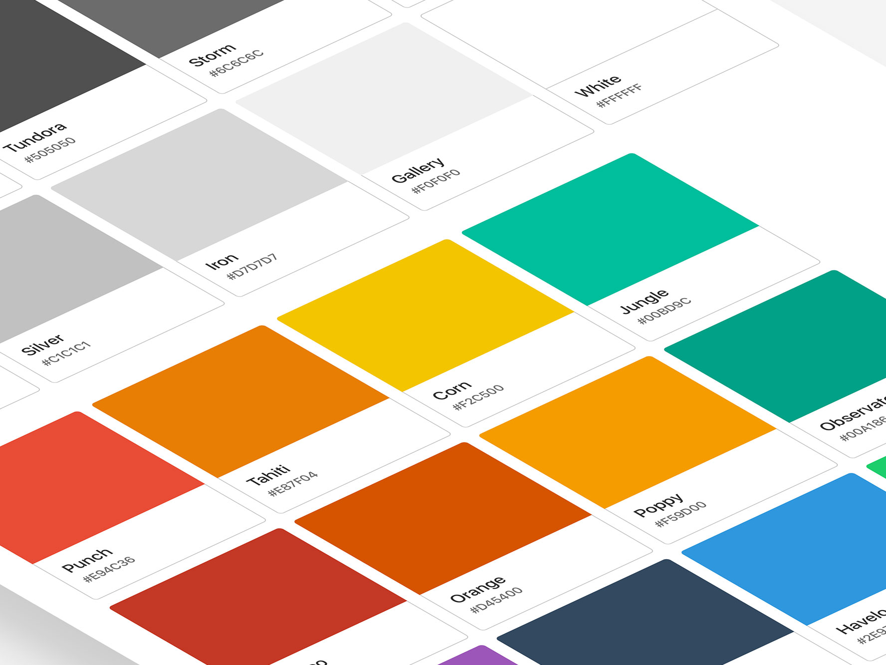
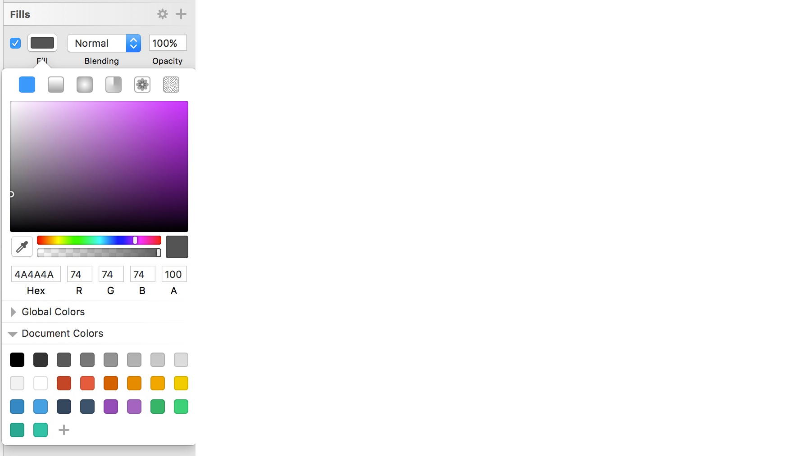
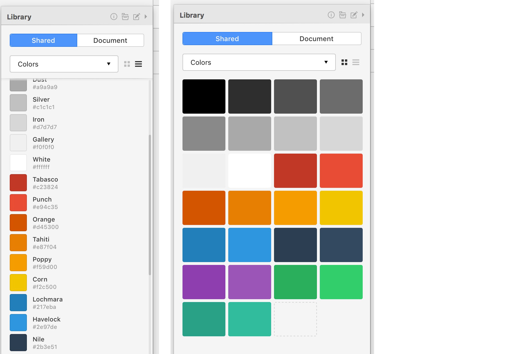
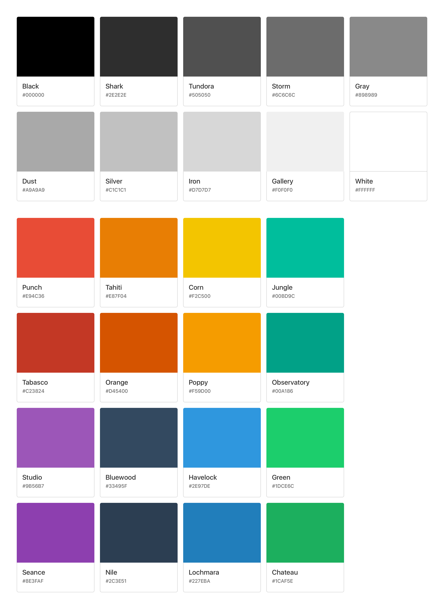

# Sketch Flat Palette

**Sketch Flat Palette** is a simple, flat color palette. Useful when starting new projects, or to overwrite your *Sketch global colors* in case of hard disk wipes (perhaps you're too busy to manually overwrite them 🙃).

## Installation & Usage
There are two different palettes included in the `flat-palette` folder.

#### Sketch Palettes Version
To use the `.sketchpalette` version, install [SketchPalettes](https://github.com/andrewfiorillo/sketch-palettes), and import the palette from the `Plugins -> Sketch Palettes -> Load Palette...` dropdown menu.

#### Craft Library Version
To use the `sketch-flat-palette.library` version, install [Craft](https://www.invisionapp.com/craft) by Invision, and import the Shared Library from the Craft panel.

## Feedback & Questions
Feedback or questions? [@lucaorio_](https://twitter.com/lucaorio_)

***

***

* *Flat colors from: [flatuicolors.com](https://flatuicolors.com)*
* *Color names generated with: [Kromatic](http://kromatic.thoughtbot.com)*

***

## License

***

## Contacts
* Twitter [@lucaorio](http://twitter.com/@lucaorio_)
* Website [lucaorio.com](http://lucaorio.com)
* Email [luca.o@me.com](mailto:luca.o@me.com)