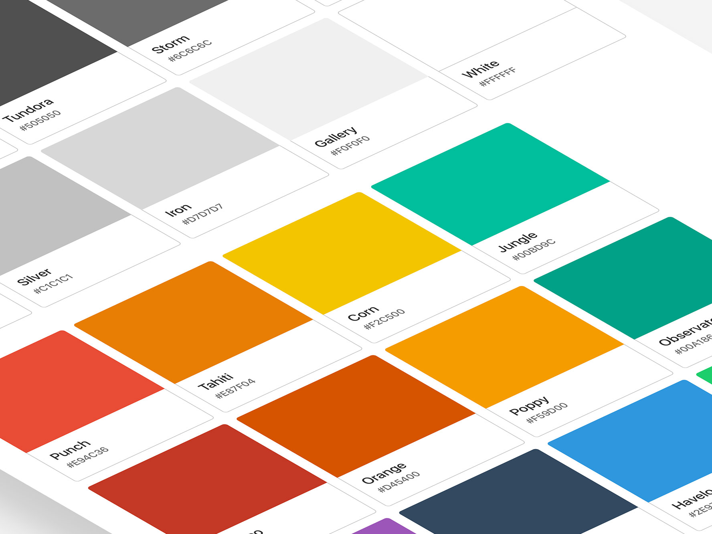
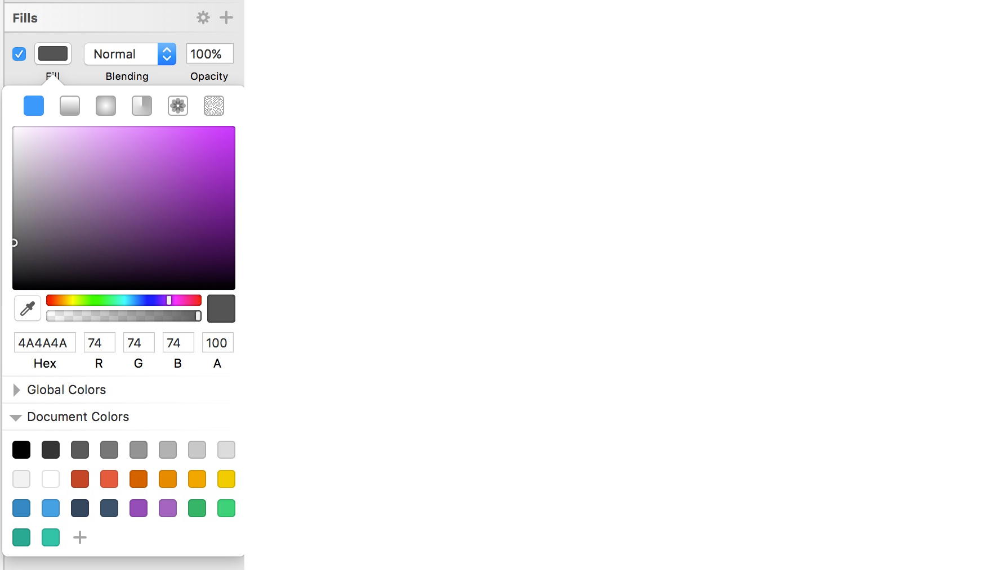
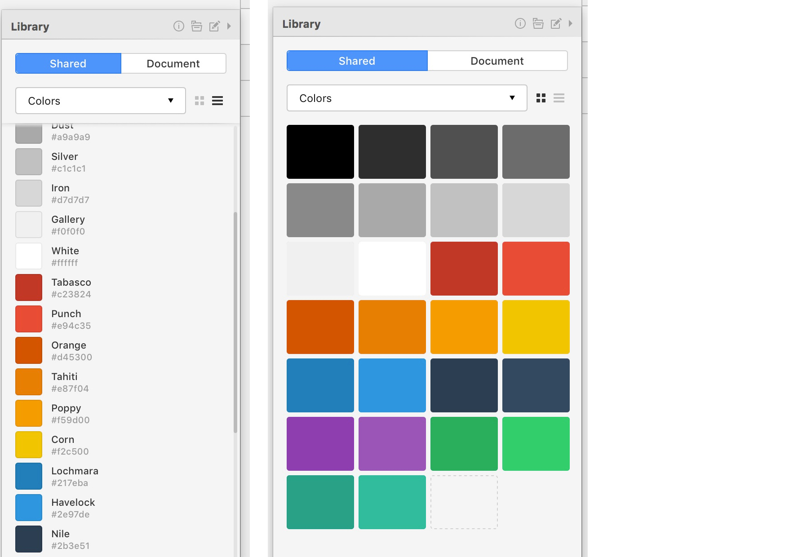
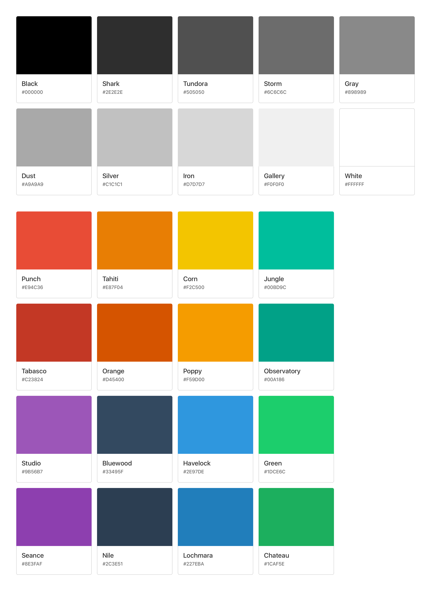

# Sketch Flat Palette


**Sketch Flat Palette** is a simple, flat color palette. Useful when starting new projects, or to overwrite your *Sketch global colors* in case of hard disk wipes (perhaps you're too busy to manually overwrite them 🙃).

## Installation & Usage
There are two different palettes included in the `flat-palette` folder.

#### Sketch Palettes Version
To use the `.sketchpalette` version, install [SketchPalettes](https://github.com/andrewfiorillo/sketch-palettes), and import the palette from the `Plugins -> Sketch Palettes -> Load Palette...` dropdown menu.



#### Craft Library Version
To use the `sketch-flat-palette.library` version, install [Craft](https://www.invisionapp.com/craft) by Invision, and import the Shared Library from the Craft panel.



## Feedback & Questions
Feedback or questions? [@lucaorio_](https://twitter.com/lucaorio_)

***



***

* *Flat colors from: [flatuicolors.com](https://flatuicolors.com)*
* *Color names generated with: [Kromatic](http://kromatic.thoughtbot.com)*

***

## License

```
This is free and unencumbered software released into the public domain.

Anyone is free to copy, modify, publish, use, compile, sell, or
distribute this software, either in source code form or as a compiled
binary, for any purpose, commercial or non-commercial, and by any
means.

In jurisdictions that recognize copyright laws, the author or authors
of this software dedicate any and all copyright interest in the
software to the public domain. We make this dedication for the benefit
of the public at large and to the detriment of our heirs and
successors. We intend this dedication to be an overt act of
relinquishment in perpetuity of all present and future rights to this
software under copyright law.

THE SOFTWARE IS PROVIDED "AS IS", WITHOUT WARRANTY OF ANY KIND,
EXPRESS OR IMPLIED, INCLUDING BUT NOT LIMITED TO THE WARRANTIES OF
MERCHANTABILITY, FITNESS FOR A PARTICULAR PURPOSE AND NONINFRINGEMENT.
IN NO EVENT SHALL THE AUTHORS BE LIABLE FOR ANY CLAIM, DAMAGES OR
OTHER LIABILITY, WHETHER IN AN ACTION OF CONTRACT, TORT OR OTHERWISE,
ARISING FROM, OUT OF OR IN CONNECTION WITH THE SOFTWARE OR THE USE OR
OTHER DEALINGS IN THE SOFTWARE.

For more information, please refer to <http://unlicense.org>
```